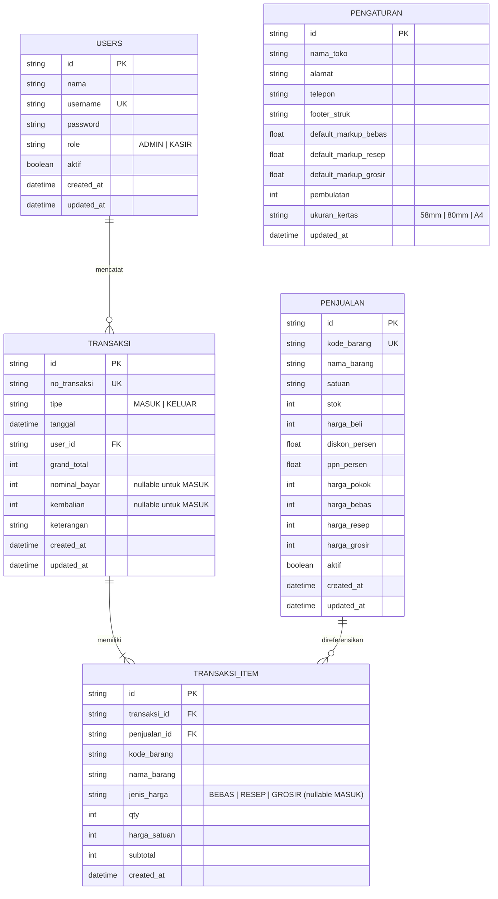

# Rencana Implementasi: Sistem Penjualan & Stok Barang (POS + Inventori)

Dokumen ini memuat arsitektur teknis, desain database (ERD), struktur direktori, detail logika kalkulator harga, dan roadmap pengerjaan 7 milestone yang telah direvisi sesuai instruksi pengguna.

---

## 1. Stack Teknologi Final

- **Framework**: [Next.js](https://nextjs.org/) 15 (App Router) + TypeScript
- **Styling**: Tailwind CSS (Desain modern, palet warna elegan, touch-friendly untuk POS kasir)
- **Database & ORM**: SQLite (via [Prisma ORM](https://www.prisma.io/)), transisi mudah ke PostgreSQL
- **Autentikasi & Keamanan**: Session berbasis HTTP-Only Secure Cookie (Signed JWT stateless menggunakan `jose`), password hashing dengan `bcryptjs`, login rate limiting untuk mitigasi brute-force
- **Otorisasi Ketat**: Pengecekan role (`ADMIN`/`KASIR`) dan status `aktif` di dua lapis: Middleware Next.js dan di setiap Route Handler / Server Action
- **Validasi Data**: [Zod](https://zod.dev/) untuk validasi form input & validasi baris impor Excel di sisi server
- **Pengolahan Excel**: [ExcelJS](https://github.com/exceljs/exceljs) untuk parsing, validasi baris, dan ekspor spreadsheet .xlsx
- **Grafik & Visualisasi**: [Chart.js](https://www.chartjs.org/) + `react-chartjs-2`
- **Testing**: [Vitest](https://vitest.dev/) untuk pengujian unit `pricing.ts` dan kalkulasi mutasi stok
- **Cetak Struk**: CSS `@media print` + `@page` dengan dukungan ukuran kertas 58mm, 80mm, dan A4

---

## 2. Keputusan Desain Database & ERD

### Ketentuan Data Khusus:
1. **Semua Kolom Uang Menggunakan `Int`**: Seluruh kolom moneter (`harga_beli`, `harga_pokok`, `harga_bebas`, `harga_resep`, `harga_grosir`, `harga_satuan`, `subtotal`, `grand_total`, `nominal_bayar`, `kembalian`) bertipe `Int` Rupiah untuk mengeliminasi potensi bug *floating-point arithmetic*.
2. **Soft Delete pada Master Barang (`Penjualan`)**: Kolom `aktif: Boolean` default `true`. Barang yang sudah memiliki riwayat transaksi tidak boleh dihapus fisik (hard delete) dari database demi menjaga integritas data riwayat transaksi.
3. **Tabel Master Barang Bernama `Penjualan`**: Sesuai dengan spesifikasi prompt: `penjualan` (master barang & harga jual).
4. **Header & Detail Transaksi (`Transaksi` & `TransaksiItem`)**:
   - Satu transaksi kasir dapat menampung banyak item barang.
   - Header menyimpan metadata struk (`no_transaksi`, `tipe`: `MASUK` / `KELUAR`, `tanggal`, `user_id`, `grand_total`, `nominal_bayar`, `kembalian`, `keterangan`).
   - Pada transaksi tipe **MASUK**: `nominal_bayar`, `kembalian`, dan `jenis_harga` bernilai **nullable** (`null`). Nilai `harga_satuan` pada MASUK adalah **harga beli**.
   - Pada barang masuk dengan harga beli baru: `harga_pokok` master barang diperbarui dengan HPP terbaru, namun **harga jual TIDAK berubah otomatis** (admin meninjau dan menghitung ulang secara sadar lewat form/kalkulator).
5. **Pengurangan Stok Bersyarat & Atomic**: Pengurangan stok saat transaksi KELUAR dieksekusi dengan update bersyarat atomic di dalam DB Transaction (`WHERE id = ? AND stok >= qty`). Transaksi dibatalkan (rollback) jika stok tidak mencukupi, mencegah *race condition* dan stok minus.
6. **Tabel `Pengaturan`**: Konfigurasi nama toko, alamat, telepon, footer struk, default markup bebas/resep/grosir (Float persen), pembulatan harga (1, 50, 100, 500), dan ukuran kertas default (58mm, 80mm, A4).

---

### Diagram Relasi Entitas (ERD)



---

## 3. Logika Terpusat Kalkulator Harga (`src/services/pricing.ts`)

Perhitungan berbasis bilangan bulat (integer rupiah):

1. **Harga Setelah Diskon**:
   $$\text{harga\_setelah\_diskon} = \text{round}\left(\text{harga\_beli} \times \left(1 - \frac{\text{diskon\_persen}}{100}\right)\right)$$
2. **Harga Pokok (HPP)**:
   $$\text{harga\_pokok} = \text{round}\left(\text{harga\_setelah\_diskon} \times \left(1 + \frac{\text{ppn\_persen}}{100}\right)\right)$$
3. **Harga Jual Berdasarkan Markup**:
   $$\text{harga\_kotor} = \text{harga\_pokok} \times \left(1 + \frac{\text{markup\_persen}}{100}\right)$$
4. **Fungsi Pembulatan Integer**:
   $$\text{harga\_bulat} = \left\lceil \frac{\text{harga\_kotor}}{\text{step}} \right\rceil \times \text{step} \quad (\text{step: } 1, 50, 100, 500)$$
5. **Kustomisasi**: Hasil kalkulasi otomatis dapat ditimpa manual oleh pengguna pada form barang masuk / edit barang.

---

## 4. Struktur Folder Proyek

```text
/
├── prisma/
│   ├── schema.prisma         # Definisi model DB SQLite (User, Penjualan, Transaksi, TransaksiItem, Pengaturan)
│   └── seed.ts               # Seeder: 1 admin, 1 kasir, 20 barang contoh, setting default
├── public/
│   └── templates/            # Template Excel barang (.xlsx)
├── src/
│   ├── app/
│   │   ├── api/
│   │   │   ├── auth/         # Login, logout, session
│   │   │   ├── barang/       # CRUD penjualan/barang, import/export exceljs
│   │   │   ├── transaksi/    # Transaksi masuk & keluar, mutasi stok atomic
│   │   │   ├── struk/        # Data struk & cetak batch
│   │   │   ├── dashboard/    # Agregasi data Chart.js
│   │   │   └── pengaturan/   # Simpan & ambil setting toko dan markup
│   │   ├── (auth)/
│   │   │   └── login/        # Halaman Login
│   │   ├── (dashboard)/
│   │   │   ├── layout.tsx    # Shell aplikasi, sidebar navigasi, header
│   │   │   ├── page.tsx      # Dashboard ringkasan & grafik (Admin)
│   │   │   ├── barang/       # Master barang (Penjualan), kalkulator harga, modal CRUD
│   │   │   ├── import-export/# Unduh template, impor validasi ExcelJS, ekspor filter tanggal
│   │   │   ├── transaksi/
│   │   │   │   ├── masuk/    # Form barang masuk (restock)
│   │   │   │   └── kasir/    # POS kasir: cepat, shortcut F2/Enter/F9, multi-item
│   │   │   ├── struk/        # Daftar struk, cetak ulang, cetak batch
│   │   │   ├── pengguna/     # Manajemen akun kasir & admin (khusus Admin)
│   │   │   └── pengaturan/   # Konfigurasi toko, persentase markup, struk
│   ├── components/
│   │   ├── ui/               # Button, Modal, Input, Badge, Toast, Table, Card
│   │   ├── layout/           # Sidebar, Navbar, PageHeader
│   │   ├── pos/              # Keranjang POS, Modal Bayar, Shortcut Handler
│   │   ├── struk/            # StrukThermal (58mm, 80mm), StrukA4, PrintPreview
│   │   └── charts/           # BarChart, DoughnutChart, LineChart (Chart.js)
│   ├── lib/
│   │   ├── prisma.ts         # Prisma client instance singleton
│   │   ├── auth.ts           # Token cookie, verify token, hash password, server-side guard
│   │   ├── rate-limit.ts     # Proteksi brute-force login
│   │   ├── format.ts         # Format Rupiah (Rp 1.250.000), format tanggal ID
│   │   └── excel.ts          # Helper ExcelJS (parse, generate, validate)
│   ├── services/
│   │   ├── pricing.ts        # LOGIKA HARGA TUNGGAL: diskon, ppn, hpp, markup, pembulatan
│   │   └── stok.ts           # Mutasi stok atomic DB transaction (masuk / keluar bersyarat)
│   ├── middleware.ts         # Middleware otorisasi server-side
│   └── types/                # Tipe TypeScript DTO & Prisma
├── tests/
│   ├── pricing.test.ts       # Unit test rumus pricing & pembulatan
│   └── stok.test.ts          # Unit test mutasi stok & pencegahan stok minus
├── package.json
├── tailwind.config.ts
├── tsconfig.json
├── vitest.config.ts
└── README.md
```

---

## 5. Rencana Tahapan Eksekusi (7 Milestone)

| Milestone | Ruang Lingkup Kerja | Indikator Keberhasilan |
|---|---|---|
| **(a) Setup + Auth + DB** | - Init Next.js + Tailwind + TypeScript<br>- Konfigurasi Prisma + SQLite (`User`, `Penjualan`, `Transaksi`, `TransaksiItem`, `Pengaturan`)<br>- Seeder: 20 barang contoh, 1 admin, 1 kasir, setting default toko<br>- Auth: login rate-limiting, session httpOnly, password bcrypt<br>- Validasi role & aktif di middleware dan route handler | Login admin & kasir sukses, kasir dibatasi, error auth Bahasa Indonesia. |
| **(b) CRUD Barang + Kalkulator** | - Service `src/services/pricing.ts`<br>- Halaman Master Penjualan/Barang (tabel, search, filter, pagination, soft delete `aktif`)<br>- Modal Tambah/Edit Barang dengan kalkulator harga real-time (HPP, bebas, resep, grosir)<br>- Tampilan harga grosir langsung di tabel master barang | Barang dapat ditambah/diedit/soft-delete, kalkulator otomatis berfungsi akurat dan dapat ditimpa manual. |
| **(c) Import & Export Excel** | - Unduh template Excel (.xlsx)<br>- Form upload ExcelJS dengan preview data sebelum disimpan<br>- Validasi Zod per baris & laporan rinci baris gagal beserta alasannya<br>- Fitur opsi "Perbarui jika kode barang sudah ada"<br>- Ekspor data barang dan transaksi ke .xlsx menggunakan ExcelJS dengan filter tanggal | Import file berhasil mendeteksi error/update data, ekspor file rapi. |
| **(d) Transaksi Masuk & Keluar (POS)** | - Transaksi Masuk: Restock barang, update harga beli & HPP terbaru tanpa mengubah harga jual otomatis, stok bertambah via Prisma transaction<br>- Transaksi Keluar (Kasir): Keranjang belanja multi-item, pilih jenis harga (bebas/resep/grosir), hitung subtotal & total<br>- Shortcut: `Enter`, `F2`, `F9`<br>- Pengurangan stok atomic bersyarat (`stok >= qty`)<br>- Input bayar & hitung kembalian otomatis | Alur kasir lancar, atomic transaction aman dari race condition, transaksi tersimpan rapi. |
| **(e) Struk & Cetak Batch** | - Komponen cetak struk CSS `@media print` untuk ukuran 58mm, 80mm, dan A4<br>- Isi struk lengkap (nama toko, no transaksi, kasir, rincian barang, total, bayar, kembalian)<br>- Halaman "Daftar Struk": riwayat transaksi, cetak ulang per struk<br>- Fitur Cetak Batch: cetak banyak struk sekaligus via seleksi checkbox atau rentang tanggal | Cetak struk rapi di berbagai ukuran kertas, cetak batch berfungsi tanpa batasan jumlah. |
| **(f) Dashboard & Grafik** | - Ringkasan metrik statistik (omzet, total transaksi hari ini, total barang, stok menipis)<br>- Visualisasi Chart.js: Barang Masuk vs Keluar, Penjualan per Jenis Harga, 10 Barang Terlaris, Alert Stok Menipis, Perbandingan Penjualan Antar Kasir<br>- Filter rentang tanggal dashboard interaktif | Grafik Chart.js tampil responsif, data teragregasi akurat sesuai filter tanggal. |
| **(g) Polish + Test + Pengaturan + README** | - Halaman Pengaturan (profil toko, % markup bebas/resep/grosir, pembulatan, ukuran kertas)<br>- Unit test Vitest untuk `pricing.ts` dan mutasi stok<br>- Audit seluruh role security & handling error seragam berbahasa Indonesia<br>- README.md komprehensif (instalasi, migrasi, seed, akun demo, backup & restore DB SQLite) | Seluruh test lolos 100%, UI responsif tanpa bug, dokumentasi lengkap siap pakai. |
